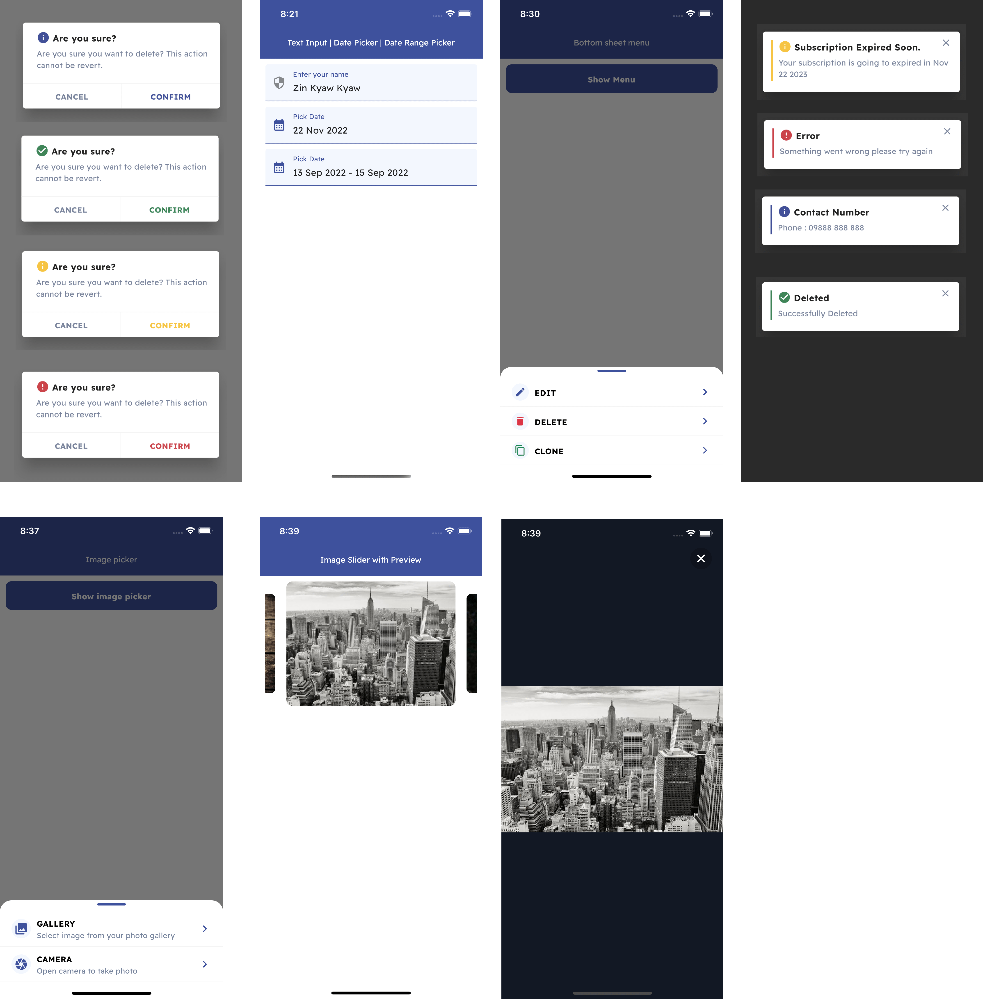

### Bilions UI Components

This package is currently in beta




### Functions

##### Alert

```
alert(
  'Title here',
  'Description here',
  type: 'warning', 
)

```
- type `success, waring, danger, info`

##### Toast

```
toast('Confirmed', type: 'success');

```
- type `success, waring, danger, info`

##### Confirm Dialog
```
confirm(ConfirmDialog(
    'Are you sure?', 
    confirmed: () {
      // do something here
    },
  ),
)
```

##### Image Preview

```
preview([
  'https://picsum.photos/id/237/536/354',
  'https://picsum.photos/id/238/536/354',
  'https://picsum.photos/id/239/536/354',
])

```

##### Menu 

```
menu(
  MenuList([
    MenuListItem(
      Icon(
        Icons.edit,
        size: 20,
      ),
      title: 'Edit',
      onPressed: () {
        // do something
      },
    ),
  ])
)
```

### Component Widgets

##### Avatar Image 

```
Avatar(
  'https://i.pravatar.cc/150?img=3',
  title: 'Zin Kyaw Kyaw',
  subTitle: 'aj@bilions.org',
)
```

##### Image Slider 

```
ImageSlider([
  'https://picsum.photos/id/237/536/354',
  'https://picsum.photos/id/238/536/354',
  'https://picsum.photos/id/239/536/354',
])
```
##### Primary Button

```
PrimaryButton(
  'Button Title',
  onPressed: () {
    // do something
  },
)
```
##### Secondary Button

```
SecondaryButton(
  'Button Title',
  onPressed: () {
    // do something
  },
)
```

##### Card 
```
CardWidget(
  header: const Avatar(
    'https://i.pravatar.cc/150?img=3',
    title: 'Zin Kyaw Kyaw',
    subTitle: 'aj@bilions.org',
  ),
  body: Column(
    children: const [
      Span(
        "Lorem Ipsum is simply dummy text of the printing and typesetting industry. Lorem Ipsum has been the industry's standard dummy text ever since the 1500s, when an unknown printer took a galley of type and scrambled it to make a type specimen book. It has survived not only five centuries, but also the leap into electronic typesetting, remaining essentially unchanged. It was popularised in the 1960s with the release of Letraset sheets containing Lorem Ipsum passages, and more recently with desktop publishing software like Aldus PageMaker including versions of Lorem Ipsum.",
      )
    ],
  ),
  footer: const Text('This is footer'),
)
```