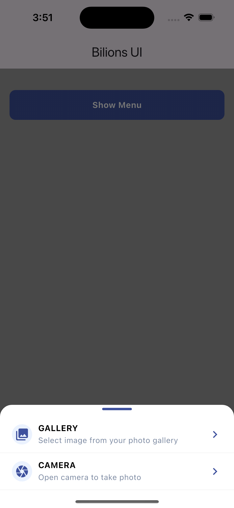

# Bottom Sheet Menu

{width=200px style="border-radius: 20px;"}

## Import

```dart
import 'package:bilions_ui/bilions_ui.dart';

```

## Usage

```dart

...

onPressed: () {
  BBottomSheetMenu.show(
    widget: BBottomSheetMenuList(
      list: [
        MenuListItem(
          Icon(
            Icons.photo_library_rounded,
            color: BColors.primary,
          ),
          title: 'Gallery',
          subTitle: 'Select image from your photo gallery',
          onPressed: () async {
            //
          },
        ),
        MenuListItem(
          Icon(
            Icons.camera,
            color: BColors.primary,
          ),
          title: 'Camera',
          subTitle: 'Open camera to take photo',
          onPressed: () async {
            //
          },
        ),
      ],
    ),
  );
}

...

```

## Properties

| Property          | Description                 | Type                   |
| ----------------- | --------------------------- | ---------------------- |
| `widget`          | BBottomSheetMenuList Widget | `BBottomSheetMenuList` |
| `radius`          | Menu radius                 | `double`               |
| `barColor`        | Menu bar color              | `Color`                |
| `backgroundColor` | Background color            | `Color`                |

### `BMenuList` Properties

| Property        | Description    | Type                 |
| --------------- | -------------- | -------------------- |
| `list`          | List of items  | `List<MenuListItem>` |
| `lineColor`     | Line color     | `Color`              |
| `lineThickness` | Line thickness | `double`             |

### `BMenuListItem` Properties

| Property     | Description       | Type       |
| ------------ | ----------------- | ---------- |
| `icon`       | Icon widget       | `Widget`   |
| `title`      | Title text        | `String`   |
| `subTitle`   | Subtitle text     | `String`   |
| `subFixIcon` | Subtitle fix icon | `Widget`   |
| `onPressed`  | On pressed        | `Function` |
