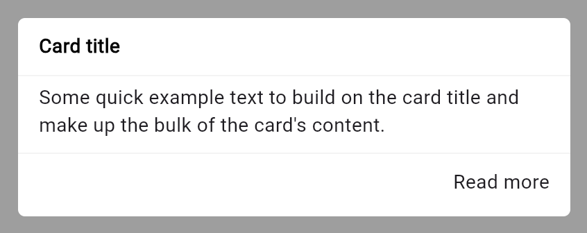

# Card

{width=400px style="border-radius: 10px;"}

## Import

```dart
import 'package:bilions_ui/bilions_ui.dart';

```

## Usage

```dart
BCard(
  title: 'Card title',
  body: Text(
    'Some quick example text to build on the card title and make up the bulk of the card\'s content.',
  ),
  footer: Row(
    children: [
      Spacer(),
      Text('Read more'),
    ],
  ),
)
```

## Properties

| Property          | Description                                         | Type       |
| ----------------- | --------------------------------------------------- | ---------- |
| `header`          | Card header                                         | `Widget`   |
| `title`           | Card title as string in the header                  | `String`   |
| `body`            | Alert message                                       | `Widget`   |
| `footer`          | Card footer                                         | `Widget`   |
| `onPressed`       | Trigger when card is pressed                        | `Function` |
| `showLine`        | Show separation line in the header, body and footer | `bool`     |
| `backgroundColor` | Card background color                               | `Color`    |
| `borderRadius`    | Card border radius                                  | `double`   |
