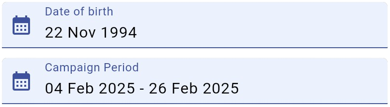

# Date Pickers

{width=400px style="border-radius: 10px;"}

## Import

```dart
import 'package:bilions_ui/bilions_ui.dart';

```

## Date Picker

```dart
String? dateOfBirth = '2025-02-01';

...

BDatePicker(
  initialValue: dateOfBirth,
  label: 'Date Of Birth',
  placeholder: 'Select Date',
  onChanged: (value) {
    setState(() => dateOfBirth = value);
  },
)

...

```

## Date Picker Properties

| Property           | Description                              | Type                     |
| ------------------ | ---------------------------------------- | ------------------------ |
| `initialValue`     | Initial value of the date picker         | `String`                 |
| `onChanged`        | Callback when the date picker is changed | `Function(String value)` |
| `label`            | Label of the date picker                 | `String`                 |
| `placeholder`      | Placeholder of the date picker           | `String`                 |
| `variant`          | Variant of the date picker               | `BVariant`               |
| `suffixIcon`       | Suffix icon of the date picker           | `Widget`                 |
| `labelColor`       | Label color of the date picker           | `Color`                  |
| `textColor`        | Text color of the date picker            | `Color`                  |
| `prefixIcon`       | Prefix icon of the date picker           | `Widget`                 |
| `borderRadius`     | Border radius of the date picker         | `double`                 |
| `placeholderColor` | Placeholder color of the date picker     | `Color`                  |

## Range Picker

```dart
List<String> campaignPeriod = ['2025-02-01', '2025-08-01'];

...

BDateRangePicker(
  initialValue: campaignPeriod,
  label: 'Campaign Period',
  placeholder: 'Select date range',
  onChanged: (value) {
    console.log('DDDD $value');
    setState(() => campaignPeriod = value);
  },
),

...

```

## Range Picker Properties

| Property           | Description                                    | Type                           |
| ------------------ | ---------------------------------------------- | ------------------------------ |
| `initialValue`     | Initial value of the date range picker         | `List<String>`                 |
| `onChanged`        | Callback when the date range picker is changed | `Function(List<String> value)` |
| `label`            | Label of the date range picker                 | `String`                       |
| `placeholder`      | Placeholder of the date range picker           | `String`                       |
| `variant`          | Variant of the date range picker               | `BVariant`                     |
| `suffixIcon`       | Suffix icon of the date range picker           | `Widget`                       |
| `labelColor`       | Label color of the date range picker           | `Color`                        |
| `textColor`        | Text color of the date range picker            | `Color`                        |
| `prefixIcon`       | Prefix icon of the date range picker           | `Widget`                       |
| `borderRadius`     | Border radius of the date range picker         | `double`                       |
| `placeholderColor` | Placeholder color of the date range picker     | `Color`                        |
