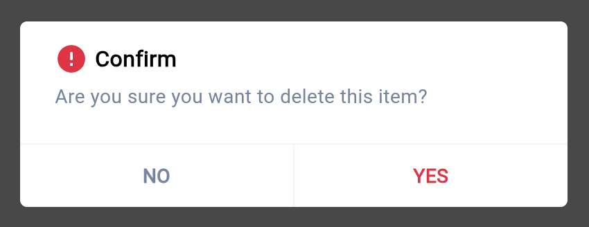
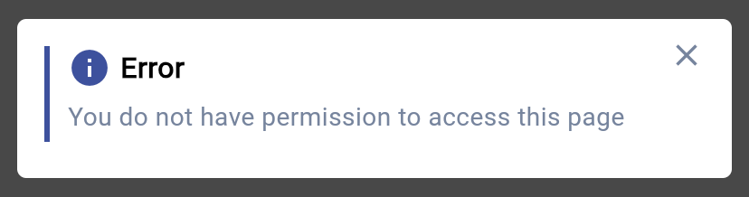

# Dialog

{width=400px style="border-radius: 10px;"}

## Import

```dart
import 'package:bilions_ui/bilions_ui.dart';

```

## Usage

```dart
onPressed: () {
  ...
  BConfirmDialog.show(
    title: 'Confirm',
    message: 'Are you sure you want to delete this item?',
    onConfirm: () => print('Confirmed'),
    onCancel: () => print('Canceled'),
    variant: BVariant.danger,
    confirmText: 'YES',
    cancelText: 'NO',
  );
  ...
}

```

## Properties

| Property           | Description                      | Type       |
| ------------------ | -------------------------------- | ---------- |
| `title`            | Dialog title                     | `String`   |
| `onConfirm`        | Trigger when dialog is confirmed | `Function` |
| `message`          | Dialog message as string         | `String`   |
| `messageWidget`    | Dialog message as widget         | `Widget`   |
| `variant`          | Dialog variant                   | `BVariant` |
| `onCancel`         | Trigger when dialog is canceled  | `Function` |
| `confirmText`      | Confirm text                     | `String`   |
| `cancelText`       | Cancel text                      | `String`   |
| `confirmTextColor` | Confirm text color               | `Color`    |
| `cancelTextColor`  | Cancel text color                | `Color`    |
| `lineColor`        | Line color                       | `Color`    |
| `lineThickness`    | Line thickness                   | `double`   |

## Alert Dialog

{width=400px style="border-radius: 10px;"}

```dart
BAlertDialog.show(
  title: 'Error',
  message: 'First name and last name is required in the field',
);
```

## Alert Dialog Properties

| Property          | Description                                                    | Type       |
| ----------------- | -------------------------------------------------------------- | ---------- |
| `title`           | Alert title                                                    | `String`   |
| `message`         | Alert message                                                  | `String`   |
| `variant`         | Alert variant such as success, error, warning, info, etc.      | `BVariant` |
| `onClosed`        | If on closed function is present, it will show close indicator | `Function` |
| `icon`            | Alert prefix icon                                              | `Widget`   |
| `backgroundColor` | Alert background color                                         | `Color`    |
