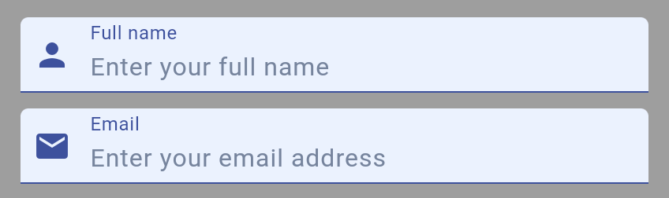
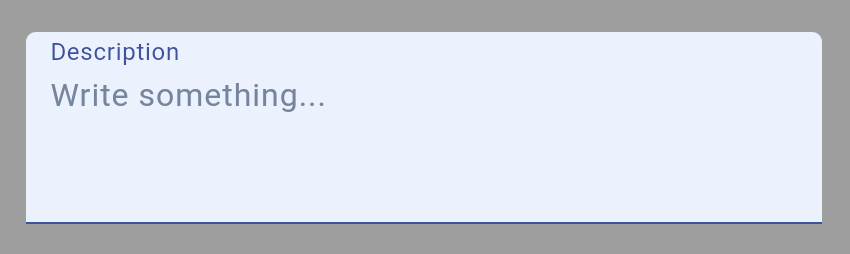

# Text Input

{width=400px style="border-radius: 10px;"}

## Import

```dart
import 'package:bilions_ui/bilions_ui.dart';

```

## Usage

```dart
String firstName = 'AJ';

...

BTextInput(
  initialValue: firstName,
  label: 'First name',
  placeholder: 'Enter your first name',
  prefixIcon: Icon(Icons.person, color: BColors.primary),
  onChanged: (value) {
    setState(() {
      firstName = value;
    });
  },
),

...

```

## Textarea Input

{width=400px style="border-radius: 10px;"}

```dart
String description = '';

...

BTextInput(
  initialValue: description,
  label: 'Description',
  maxLines: 3,
  placeholder: 'Write something...',
  onChanged: (value) {
    setState(() {
      description = value;
    });
  },
),
...

```

## Properties

| Property           | Description                         | Type                    |
| ------------------ | ----------------------------------- | ----------------------- |
| `initialValue`     | Initial value of the text input     | `String`                |
| `label`            | Label of the text input             | `String`                |
| `placeholder`      | Placeholder of the text input       | `String`                |
| `prefixIcon`       | Prefix icon of the text input       | `Widget`                |
| `suffixIcon`       | Suffix icon of the text input       | `Widget`                |
| `onChanged`        | Trigger when text input is changed  | `Function(String)`      |
| `labelColor`       | Color of the label                  | `Color`                 |
| `placeholderColor` | Color of the placeholder            | `Color`                 |
| `textColor`        | Color of the text input             | `Color`                 |
| `variant`          | Variant of the text input           | `BVariant`              |
| `maxLines`         | Maximum lines of the text input     | `int`                   |
| `readOnly`         | Whether the text input is read only | `bool`                  |
| `onTab`            | Trigger when text input is tapped   | `Function`              |
| `controller`       | Controller of the text input        | `TextEditingController` |
| `borderRadius`     | Border radius of the text input     | `double`                |
