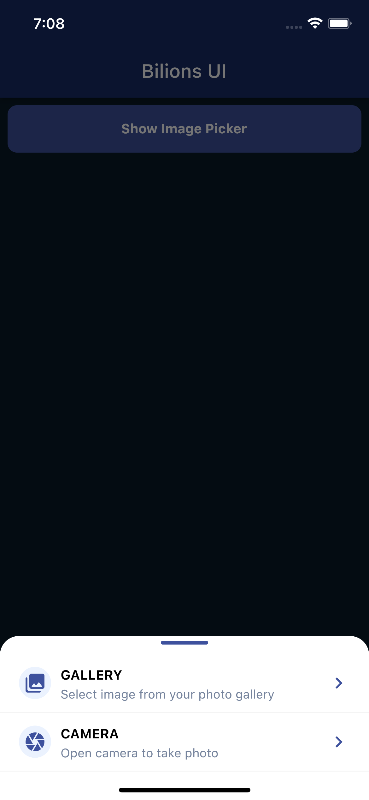
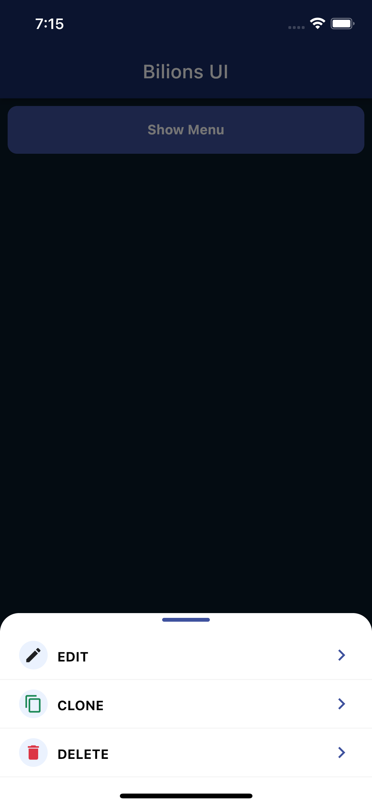
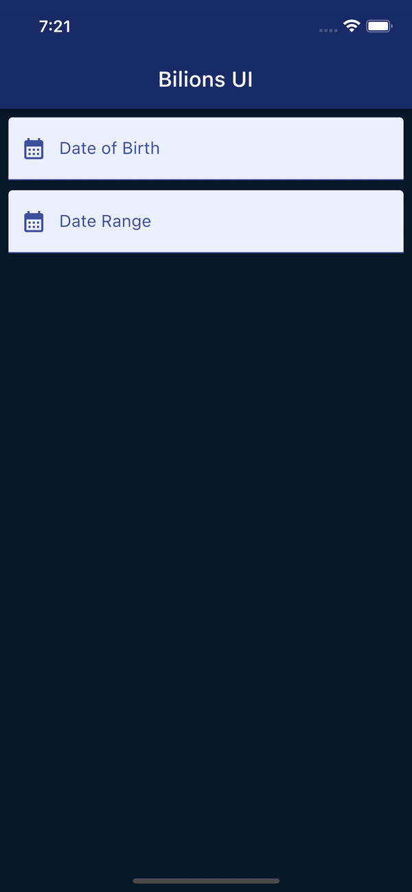

# Introduction

Next-generation UI Component suite for Flutter.

The `bilions_ui` package is a versatile Flutter library designed to simplify the creation of user interfaces by providing a collection of customizable UI components. Tailored for developers building Flutter applications, it offers a range of pre-built widgets that support various themes and styles, making it easier to craft visually appealing and consistent designs without starting from scratch.

## Overview

This package includes components such as alerts, confirmation dialogs, image previews, toast notifications, text inputs, date pickers, bottom sheet menus, buttons, avatars, and image sliders, among others. Each widget is designed with flexibility in mind, allowing developers to adjust their appearance and behavior through properties like variant, which supports theme options such as primary, success, warning, danger, and info. This theming capability ensures that the components can seamlessly integrate into different app designs or branding requirements.

Developers can further customize the package by setting global color configurations using the BilionsUI class, allowing for app-wide consistency in styling. The widgets are lightweight and designed to work with Flutter’s ecosystem, requiring minimal dependencies beyond the core framework.

Overall, bilions_ui is a practical choice for Flutter developers looking to accelerate UI development while maintaining control over customization. It’s particularly useful for projects that need a polished, professional look with minimal effort.

# Functions

## Alert
<!-- tabs:start -->
#### **Alert Code**
```dart
alert(
  context,
  'Title here',
  'Description here',
  variant: Variant.warning, 
)
```
#### **Alert Demo**

<!-- tabs:end -->


## Toast
<!-- tabs:start -->
#### **Toast Code**
```dart
toast(context, 'Confirmed', variant: Variant.success);

```
#### **Toast Demo**

<!-- tabs:end -->

## Confirm Dialog
<!-- tabs:start -->
#### **Dialog Code**
```dart
ConfirmDialog(
  'Are you sure?',
  message: 'Are you sure to delete?',
  variant: Variant.warning,
  confirmed: () {
    // do something here
  },
)
```
#### **Dialog Demo**

<!-- tabs:end -->

## Image Picker
<!-- tabs:start -->
#### **Image Picker Code**
```dart
openUploader(
  context, 
  variant: 'primary',
  onPicked: (FileInfo file) {
    console.log(file.path);
  },
);
```
#### **Image Picker Demo**

<!-- tabs:end -->

Add below lines in `ios/Runner/info.plist`

```dart
<key>NSPhotoLibraryUsageDescription</key>
<string>Allow Image access to upload your profile image</string>
<key>NSCameraUsageDescription</key>
<string>Allow Image access to upload your profile image</string>
```

## Image Preview
<!-- tabs:start -->
#### **Image Preview Code**
```dart
preview(context, [
  'https://picsum.photos/id/237/536/354',
  'https://picsum.photos/id/238/536/354',
  'https://picsum.photos/id/239/536/354',
])
```
#### **Image Preview Demo**

<!-- tabs:end -->

## Menu 
<!-- tabs:start -->
#### **Menu Code**
```dart
menu(
  context,
  MenuList([
    MenuListItem(
      const Icon(
        Icons.edit,
        size: 20,
      ),
      title: 'Edit',
      onPressed: () {
        // do something
      },
    ),
    MenuListItem(
      Icon(
        Icons.copy,
        color: BColors.success,
        size: 20,
      ),
      title: 'Clone',
      onPressed: () {
        // do something
      },
    ),
    MenuListItem(
      Icon(
        Icons.delete,
        color: BColors.danger,
        size: 20,
      ),
      title: 'Delete',
      onPressed: () {
        // do something
      },
    ),
  ]),
);
```
#### **Menu Demo**

<!-- tabs:end -->

# Components

## Date Picker Input 
<!-- tabs:start -->
#### **Date Picker Code**
```dart
BilionsDatePicker(
  label: 'Date of Birth', 
  onChanged: (date) => {}
),
```
#### **Date Range Code**
```dart
 BilionsDateRangePicker(
    label: 'Date of Birth',
    onChanged: (start, end) => {

    },
),
```
#### **Date Range & Date Picker Demo**

<!-- tabs:end -->

## TextInput

```dart
BilionsTextInput(label: 'Full Name', onChanged: (text) => {})
```

## Password Input

```dart
BilionsPasswordInput(
  label: 'Password',
  onChanged: (value) => {},
  variant: Variant.danger,
)
```

## Avatar Image 

```dart
Avatar(
  'https://i.pravatar.cc/150?img=3',
  title: 'Zin Kyaw Kyaw',
  subTitle: 'aj@bilions.org',
)
```

## Image Slider 

```dart
ImageSlider([
  'https://picsum.photos/id/237/536/354',
  'https://picsum.photos/id/238/536/354',
  'https://picsum.photos/id/239/536/354',
])
```
## Buttons

<!-- tabs:start -->

#### **Primary Button**

```dart
PrimaryButton(
  'Button Title',
  variant : Variant.success,
  onPressed: () {
    // do something
  },
)
```

#### **Secondary Button**


```dart
SecondaryButton(
  'Button Title',
  variant : Variant.success,
  onPressed: () {
    // do something
  },
)
```

<!-- tabs:end -->


## Alert Widget

```dart
BilionsAlert(
  'Wake Up',
  'You need to code flutter',
  icon: Icon(Icons.alarm),
)
```

## Card 

```dart
CardWidget(
  header: const Avatar(
    'https://i.pravatar.cc/150?img=3',
    title: 'Zin Kyaw Kyaw',
    subTitle: 'aj@bilions.org',
  ),
  body: Column(
    children: const [
      Span(
        "Lorem Ipsum is simply dummy text of the printing and variantsetting industry. Lorem Ipsum has been the industry's standard dummy text ever since the 1500s, when an unknown printer took a galley of variant and scrambled it to make a variant specimen book. It has survived not only five centuries, but also the leap into electronic variantsetting, remaining essentially unchanged. It was popularised in the 1960s with the release of Letraset sheets containing Lorem Ipsum passages, and more recently with desktop publishing software like Aldus PageMaker including versions of Lorem Ipsum.",
      )
    ],
  ),
  footer: const Text('This is footer'),
)
```

## Table

```dart
BilionsTable(
    variant: Variant.success,
    widths: const [50, 30],
    header: const [
      TextLeft('Name', color: Colors.green, bold: true),
      TextCenter('Rank', color: Colors.green, bold: true),
      TextRight('Price', color: Colors.green, bold: true),
    ],
    body: const [
      [TextLeft('Ajay Pillai'), TextCenter('1'), TextRight('1000')],
      [TextLeft('Kumar Sharno'), TextCenter('2'), TextRight('1000')],
      [TextLeft('Anju Skk'), TextCenter('3'), TextRight('1000')],
      [TextLeft('Zin Kyaw Kyaw'), TextCenter('4'), TextRight('1000')],
    ],
  ),
```

# Utils

## Date formatter

- get current date time `now()` will return Current `DateTime` instance
- format date to string `moment.dateToString(now())` will return formatted string date
- format date to string `moment(now()).format(format: 'dd MMM yyyy')` will return formatted string date
- format date to string `moment('2022-11-22').parse()` will return `DateTime` instance

## Theme Colors

```dart
BilionsColor.primary
BilionsColor.primaryLight
BilionsColor.warning
BilionsColor.warningLight
BilionsColor.danger
BilionsColor.dangerLight
BilionsColor.info
BilionsColor.infoLight
BilionsColor.success
BilionsColor.successLight
```

## Variants

```dart
Variant.primary
Variant.warning
Variant.danger
Variant.info
Variant.success
```

## Theme Color configuration
- Want to set your own colors?
- You can set your own colors in main() function

```dart
void main() {

  BilionsUI bilionsUI = BilionsUI();
  bilionsUI.setColors(
    ColorConfig(
      danger: Colors.red,
      primary: Colors.blue,
      success: Colors.green,
      warning: Colors.yellow,
      info: Colors.purple,
    ),
  );

  runApp(const MyApp());
}
```